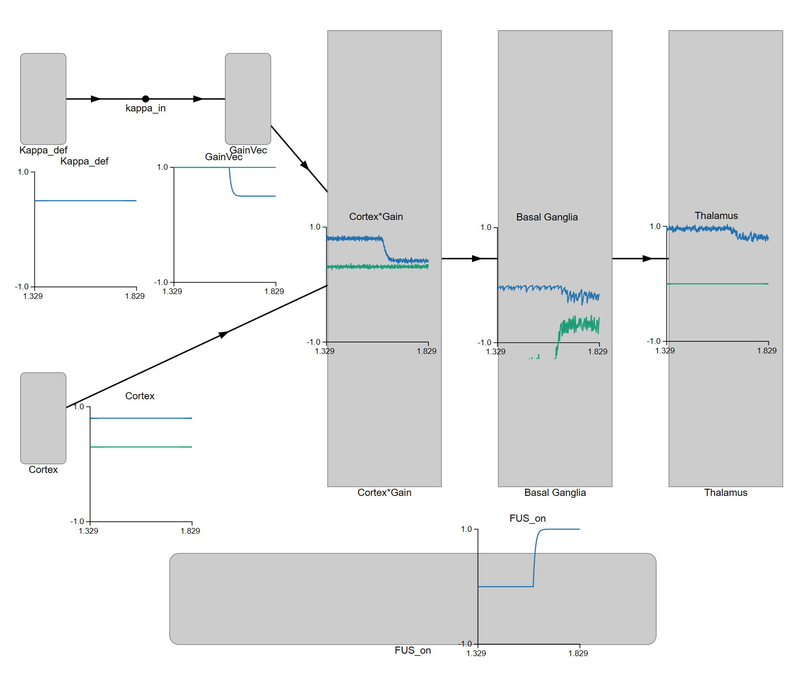

# 🧠 Basal Ganglia Action Selection with FUS Modulation

This demo shows **how the basal ganglia (BG)** select between competing actions — and how **focused ultrasound (FUS)** can modulate that process by temporarily reducing cortical drive to the striatum (as in ALIC-targeted OCD treatments).

Built in **[Nengo](https://www.nengo.ai)**, it’s both a neuroscience teaching tool and a sandbox for developing neuromodulation models.

---

## 🔍 Overview

- The **cortex** sends two action drives to the basal ganglia.  
- The **basal ganglia** inhibit all actions by default, then *disinhibit* the strongest one.  
- The **thalamus** relays the selected action back to cortex for execution.  
- **FUS** acts as a *temporary attenuator* on one corticostriatal pathway, reducing its influence.

When the FUS is active, the affected action’s signal weakens — often flipping which action “wins.”

---

## 📚 References

This model builds on the **canonical Basal Ganglia–Thalamus architecture** implemented in Nengo, derived from work by Chris Eliasmith and colleagues on biologically grounded neural computation.

- **Stewart, T. C., Bekolay, T., & Eliasmith, C. (2012).**  
  [*Learning to select actions with spiking neurons in the basal ganglia*](https://doi.org/10.3389/fnins.2012.00002).  
  *Frontiers in Neuroscience, 6, 2.*  
  → Defines the spiking Basal Ganglia and Thalamus model used in Nengo.

- **Eliasmith, C. et al. (2012).**  
  [*A Large-Scale Model of the Functioning Brain (Spaun)*](https://doi.org/10.1126/science.1225266).  
  *Science, 338(6111), 1202–1205.*  
  → Demonstrates the NEF in a full cognitive architecture integrating perception, memory, and motor control.

These works provide the theoretical and computational foundation for the present FUS-modulated action-selection model.


---

## 🧩 How It Works

| Component | Function | Analogue in Brain |
|------------|-----------|------------------|
| `cortex` | Competing input signals (two actions) | Frontal cortex |
| `BasalGanglia` | Selects one action by disinhibiting it | Striatum + GPi |
| `Thalamus` | Relays winning action to motor areas | Thalamus |
| `FUS` node | Temporarily scales down one cortical drive | ALIC pathway under ultrasound |
| `kappa_in` | Slider to control FUS strength (0–1) | Effective inhibition |

---

## ▶️ Run It

```bash
pip install nengo nengo-gui scipy
nengo_gui bg_action_fus.py
```

Then:
- **Spacebar** → start/stop simulation  
- **Right-click** nodes → add *Sliders* and *Plots*  
- Add sliders for:
  - `kappa_in` (FUS strength)
- Plot:
  - `Cortex`, `GainVec`, `BG output`, `Thalamus`

Watch the Thalamus outputs — the higher one is the “chosen” action.

---

## ⚙️ Parameters

| Variable | Meaning | Typical |
|-----------|----------|----------|
| `fus_blocks` | When FUS is active (s) | `[(1.6, 3.0)]` |
| `kappa_default` | FUS effect strength | `0.5` |
| `dimensions` | Number of actions | `2` |

---

## 🧪 What to Observe

| Phase | Expected behaviour |
|-------|--------------------|
| **Pre-FUS** | Action 1 dominates (higher cortical drive). |
| **During FUS** | Action 1 is attenuated → the *green* channel in the Basal Ganglia plot drops, showing renewed inhibition. |
| **Post-FUS** | Normal competition resumes and Thalamus output stabilises again. |

<p align="center">
  
</p>

*Screenshot showing the moment FUS activates: the FUS node rises (bottom), Action 1’s cortical drive is reduced (middle left), and the Basal Ganglia’s disinhibition of that channel collapses (middle right), restoring inhibition to Thalamus.*

---

## 🧠 For Experts

- The model uses Nengo’s **rate-based BasalGanglia** and **Thalamus** networks.  
- FUS modulation is implemented as a **time-varying multiplicative gain** on the `cortex → BG` connection.  
- Extendable to:
  - More actions (dimensions > 2)  
  - Noisy or oscillatory modulation (for PRF-locked studies)  
  - Task-switch paradigms or stop-signal models  

---

## 🌱 For Newcomers

Think of this as a **neural traffic light**:
- The **BG** holds all actions at red.  
- The **strongest** one gets a green light.  
- **FUS** temporarily dims one signal — so another may pass first.

---

## 📁 Files

| File | Purpose |
|------|----------|
| `bg_action_fus.py` | Main simulation |
| `bg_action_demo.py` | Same model without FUS |
| `README.md` | You’re reading it |

---

## 🧩 Next Steps

- Add a **FUS node** with realistic pulse trains (PRF ≈ 500 Hz).  
- Couple to an **EEG readout** model for closed-loop testing.  
- Embed as a **decision-core** inside avatar or cognitive simulations.
